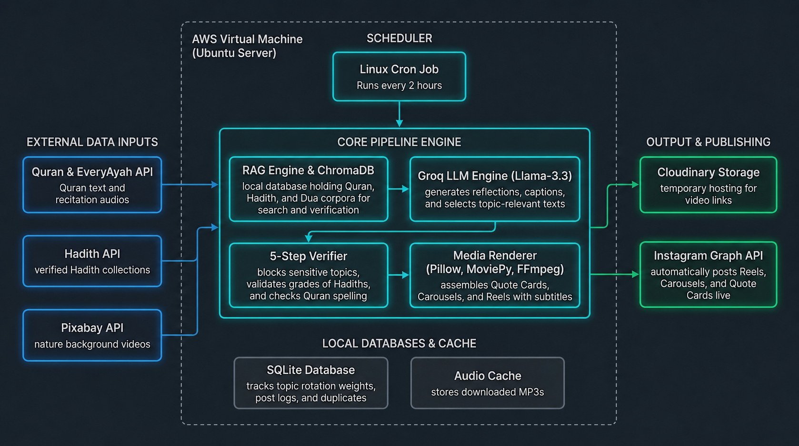

# 🕌 Islamic Content Automation Pipeline

A fully autonomous, offline-first Python bot that generates and publishes highly aesthetic, 100% authentic Quranic Instagram Reels on autopilot.




## 🏗️ Full Architecture Breakdown

This system is designed to be **indestructible** and completely self-reliant. It runs entirely on a lightweight Azure Linux VM without relying on external APIs for audio or text, ensuring zero rate-limit crashes.

### 1. Data Layer (Offline First)
Instead of relying on external APIs during generation, the bot stores the entire Quran locally.
- **Vector Database (`chroma_data/`)**: Contains all 6,236 verses in Uthmanic Arabic and Sahih English translations. The verses are mathematically embedded so the AI can search them by meaning.
- **Audio Cache (`audio_cache/`)**: Contains all 6,236 MP3 recitations (Mishary Alafasy). The bot loads audio from the hard drive instantly, completely bypassing network timeouts.

### 2. Generation Layer (AI & RAG)
- **Dynamic Topic Engine**: Selects a unique daily topic (e.g., "Patience", "Good Character") from a local SQL database.
- **RAG Engine (Retrieval-Augmented Generation)**: Searches the ChromaDB vector database to find the perfect, authentic Quranic verses matching the daily topic.
- **LLM Content Generator**: Uses Llama-3 (via Groq/OpenAI) to generate a deep, meaningful Instagram caption. It strictly enforces an Arabic reflection on top, followed by an English translation and highly optimized Deen hashtags.

### 3. Verification Layer
Before rendering, the `ContentVerifier` strictly checks the AI's output against the local database to ensure the Arabic text perfectly matches the canonical Uthmanic script. It prevents the AI from "hallucinating" fake verses.

### 4. Rendering Layer (`moviepy` & `ffmpeg`)
- **Background Manager**: Downloads stunning, high-quality nature videos from Pixabay (e.g., "Sunrise Mountains"). If Pixabay blocks the connection, it gracefully falls back to generating a custom animated background.
- **Video Assembly**: Stitches together the local MP3 clips, layers them over the nature background, and burns highly-aesthetic synchronized Arabic and English subtitles directly onto the video.

### 5. Publishing Layer (Instagram Graph API)
- Uploads the massive 15MB generated Reel to a temporary Cloudinary CDN.
- Triggers the Facebook Graph API to publish the Reel to the connected Instagram Business account.
- **Self-Cleaning**: Immediately deletes the generated `.mp4` and the raw Pixabay video from the local hard drive to ensure the server never runs out of space.

### 6. Automation Layer (Azure VM)
A master shell script (`run_pipeline.sh`) is executed by a Linux `cron` timer every 55 minutes. It logs all activity, executes the generator, checks for success, triggers the publisher, and cleans up.

---


```bash
*/55 * * * * /bin/bash /path/to/automate/run_pipeline.sh
```
### 🎬 Example Reel

[](https://res.cloudinary.com/dmvxysqvl/video/upload/v1781865831/exemple_x7zshz.mp4)

